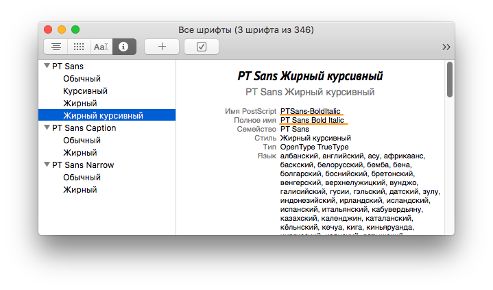

# Шрифты
## Форматы шрифтовых файлов
Используем на вебе:

- WOFF2 — самый лучший формат шрифтов для веба;
- WOFF — предыдущая версия, подключаем как фолбэк для IE10 и IE11;
- TTF — фолбэк для совсем старых бразуеров (Android 4.3, OperaMini) (возможно не нужен, проверьте требования в проекте и поддержку [WOFF](https://caniuse.com/#search=woff));

Не используем на вебе:
- EOT — мертвый формат, работает только IE<9.
- OTF — шрифтовые файлы для печати и ОС. Их конвертируют в форматы для веба.

## Конвертация для веба
Иногда в наличии есть шрифт только в формате TTF или OTF. Для конвертации используются веб-сервисы, типа [FontSquirrel](https://www.fontsquirrel.com/tools/webfont-generator). В режиме Expert можно сгенерировать шрифт только с определенным набором символов. Например, только кириллицу или латиницу, только с А до М или только цифры. Иногда бывает полезно.

Есть еще NPM-пакеты [ttf2woff](https://www.npmjs.com/package/ttf2woff) и [ttf2woff2](https://www.npmjs.com/package/ttf2woff2).

[glyphhanger](https://github.com/filamentgroup/glyphhanger) может выдрать из TTF-шрифта только те Unicode-символы, которые используются на странице. Может быть удобно для ускорения загрузки статических страницу, на которых содержимое не меняется или меняется очень редко (промо-страницы, заглушки). Вот [статья](https://www.zachleat.com/web/23-minutes/) с примером использования.

:::danger
Не все издатели разрешают конвертировать свои шрифты, изучите лицензию. Лицензия может быть на использование только на вебе или только для одной машины. Если шрифт лицензирован для веба, с большой вероятностью вы получите и соответствующие файлы.
:::

## Использование шрифта с внешнего ресурса
Примеры сервисов, откуда можно подключать шрифты на прямую:

- [Google Fonts](https://fonts.google.com) с бесплатными шрифтами.
- На [Adobe Typekit](https://typekit.com) можно купить подписку и пользоваться библиотекой платных шрифтов.

Сервисы выдают примеры кода, которые можно просто вставить в CSS или HTML и использовать нужные шрифты и начертания.

## Подключение гарнитуры
Подключать семейство шрифта (гарнитуру) нужно так, чтобы в CSS можно было указывать жирность (`font-weight`) и начертание (`font-style`) отдельно:

```css
/* Хорошо — гарнитура отдельно, начертание отдельно */
.some-class {
    font-family: PTSans, Arial, sans-serif; /* эта строка отвечает за семейство */
    font-weight: bold; /* эта за жирность */
    font-style: italic; /* эта за начертание (стиль) */
}

/* Плохо, ад, фу-фу-фу! */
.some-class {
    font-family: 'PTSans Bold Italic', Arial, sans-serif; /* а в этом примере */
    font-weight: normal; /* все перепутано */
}
```

Пример правильного подключения гарнитуры PTSans. Обычное, полужирное, курсивное и курсивное полужирное начертания:

```css
@font-face {
    font-family: 'PTSans';
    font-weight: normal;
    font-style: normal;
    src: local('PTSans Regular'),
         url('../fonts/PTSansRegular.woff2') format('woff2'),
         url('../fonts/PTSansRegular.woff') format('woff'),
         url('../fonts/PTSansRegular.ttf') format('ttf');
}

@font-face {
    font-family: 'PTSans';
    font-weight: normal;
    font-style: italic;
    src: local('PT Sans Italic'),
        local('PTSans-Italic'),
        url('../fonts/PTSansItalic.woff2') format('woff2'),
        url('../fonts/PTSansItalic.woff') format('woff'),
        url('../fonts/PTSansItalic.ttf') format('ttf');
}

@font-face {
    font-family: 'PTSans';
    font-weight: bold;
    font-style: normal;
    src: local('PT Sans Bold'),
        local('PTSans-Bold'),
        url('../fonts/PTSansBold.woff2') format('woff2'),
        url('../fonts/PTSansBold.woff') format('woff'),
        url('../fonts/PTSansBold.ttf') format('ttf');
}

@font-face {
    font-family: 'PTSans';
    font-weight: bold;
    font-style: italic;
    src: local('PT Sans Bold Italic'),
        local('PTSans-BoldItalic'),
        url('../fonts/PTSansBoldItalic.woff2') format('woff2'),
        url('../fonts/PTSansBoldItalic.woff') format('woff'),
        url('../fonts/PTSansBoldItalic.ttf') format('ttf');
} 
```

Обратите внимание на свойство `local`. В нем можно указать, как шрифт может называться на компьютере пользователя (название шрифта в операционной системе). Таких вариантов может быть несколько.

В MacOS название шрифта можно посмотреть в программе Fonts (или Шрифты в русской версии). Пример для полужирного, курсивного PT Sans:



## Порядок свойств в CSS
Порядок свойств в CSS такой, как обычно пишут в названии шрифта: семейство, жирность, стиль.

Пример для PTSans Bold Italic:

```css
.some-class {
    font-family: PTSans, Arial, sans-serif;
    font-weight: bold;
    font-style: italic;
}
```

## Материалы
- Статья [Оптимизация шрифтов](https://developers.google.com/web/fundamentals/performance/optimizing-content-efficiency/webfont-optimization?hl=ru) на Google Web Fundamentals.
- [23 Minutes of Work for Better Font Loading](https://www.zachleat.com/web/23-minutes/)
